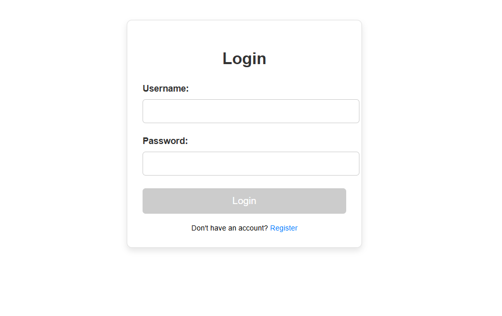
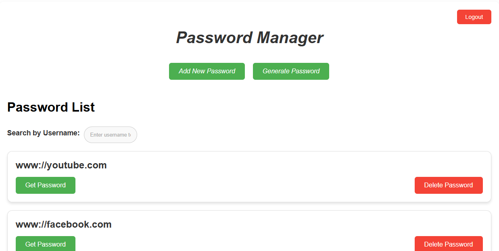
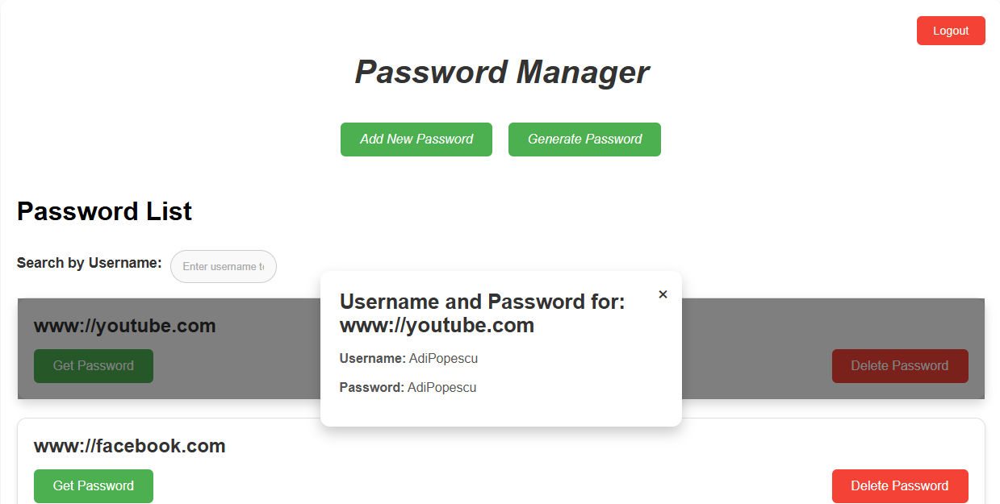
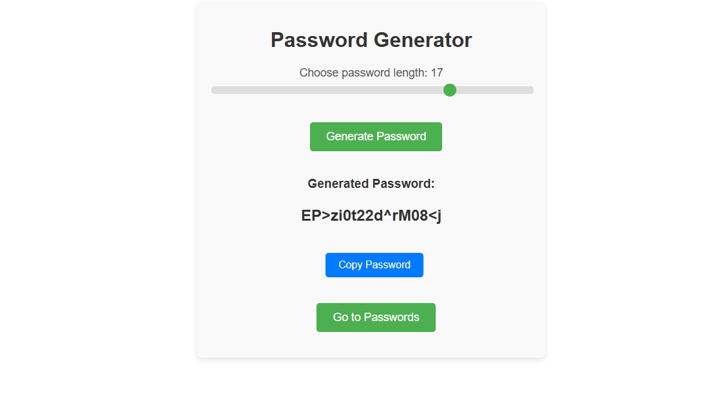

# Password Manager

A secure and user-friendly password manager built with **Angular** for the frontend and **Spring Boot** for the backend. This application allows users to securely store and manage their passwords.

## Features

- **User Registration & Login**: Secure authentication with session-based login.
- **Password Storage**: Store passwords associated with different websites.
- **Password Generation**: Generate strong and random passwords.
- **Edit & Delete Passwords**: Update or remove stored passwords.
- **Secure Access**: Uses authentication guards to restrict access to password-related pages.

## Technologies Used

### Frontend (Angular)

- Angular
- Angular Forms (Reactive Forms)
- Angular Routing
- HTTP Client for API communication

### Backend (Spring Boot)

- Spring Boot (REST API)
- MySQL (Database)
- Spring Security (Session-based Authentication)

## Screenshots
**Screenshot 1: Login**  


**Screenshot 2: Passwords**  


**Screenshot 3: Details**  


**Screenshot 4: Generate password**  


## Installation

### Backend Setup (Spring Boot)

1. Clone the repository:
   ```sh
   git clone https://github.com/PopescuAdrianIulian/Password-Manager
   cd password-manager-backend
   ```
2. Configure the database in `application.properties`:
   ```properties
   spring.datasource.url=jdbc:mysql://localhost:3306/password_manager
   spring.datasource.username=root
   spring.datasource.password=yourpassword
   ```
3. Run the backend:
   ```sh
   mvn spring-boot:run
   ```

### Frontend Setup (Angular)

1. Navigate to the frontend folder:
   ```sh
   cd password-manager-frontend
   ```
2. Install dependencies:
   ```sh
   npm install
   ```
3. Run the Angular development server:
   ```sh
   ng serve
   ```
4. Open your browser and go to `http://localhost:4200`.

## API Endpoints

| Endpoint          | Method | Description                  |
| ----------------- | ------ | ---------------------------- |
| `/auth/register`  | POST   | Register a new user          |
| `/auth/login`     | POST   | Log in to the app            |
| `/passwords`      | GET    | Fetch all saved passwords    |
| `/passwords/{id}` | GET    | Retrieve a specific password |
| `/passwords`      | POST   | Add a new password           |
| `/passwords/{id}` | DELETE | Remove a password            |

## Usage

1. **Register** an account or log in.
2. **Store passwords** for different websites.
3. **Generate** strong passwords using the built-in tool.
4. **Edit or delete** saved passwords.
5. **Logout** when you're done.

